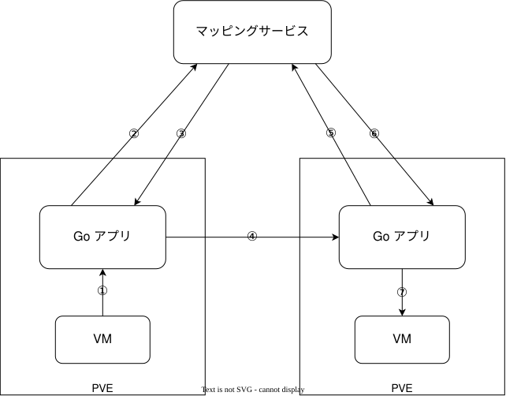

# vpc

Proxmox VE上でVPC的なものを実現しようとするやつ

## architecture

## plans

- DHCP
- VM間通信
- DNS

## no plans

- インターネット間通信（インターネットGWとして実装予定）
- eBPF/XDP（気が向いたら）

## spec

ブロードキャスト/マルチキャストはサポートしない

## ideas

issueを参照すること