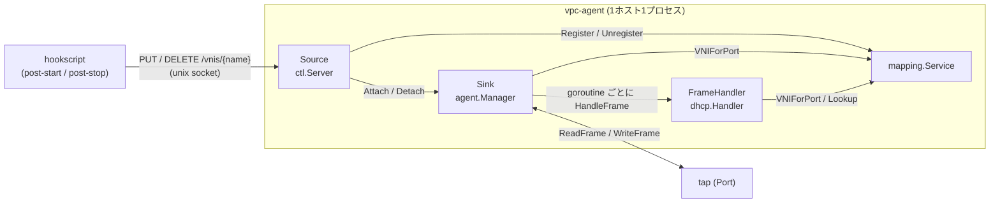
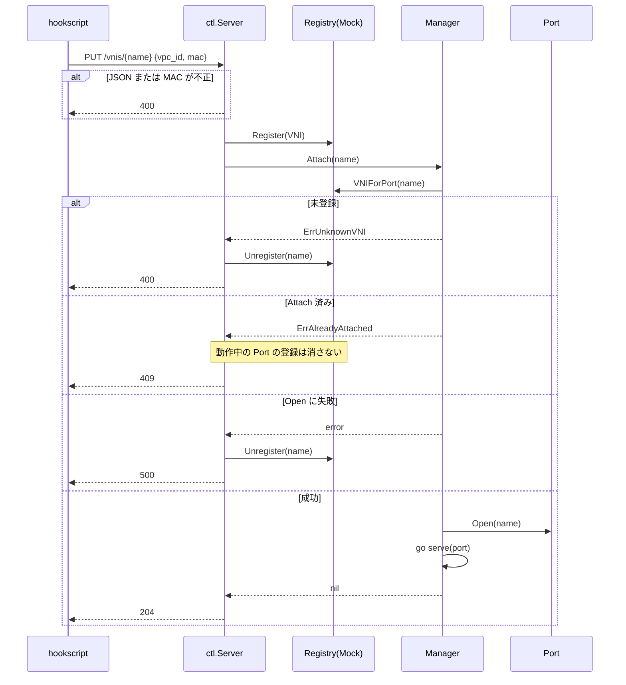
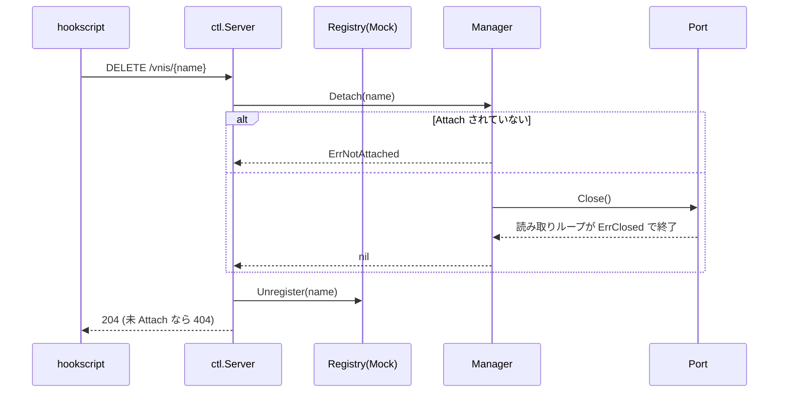
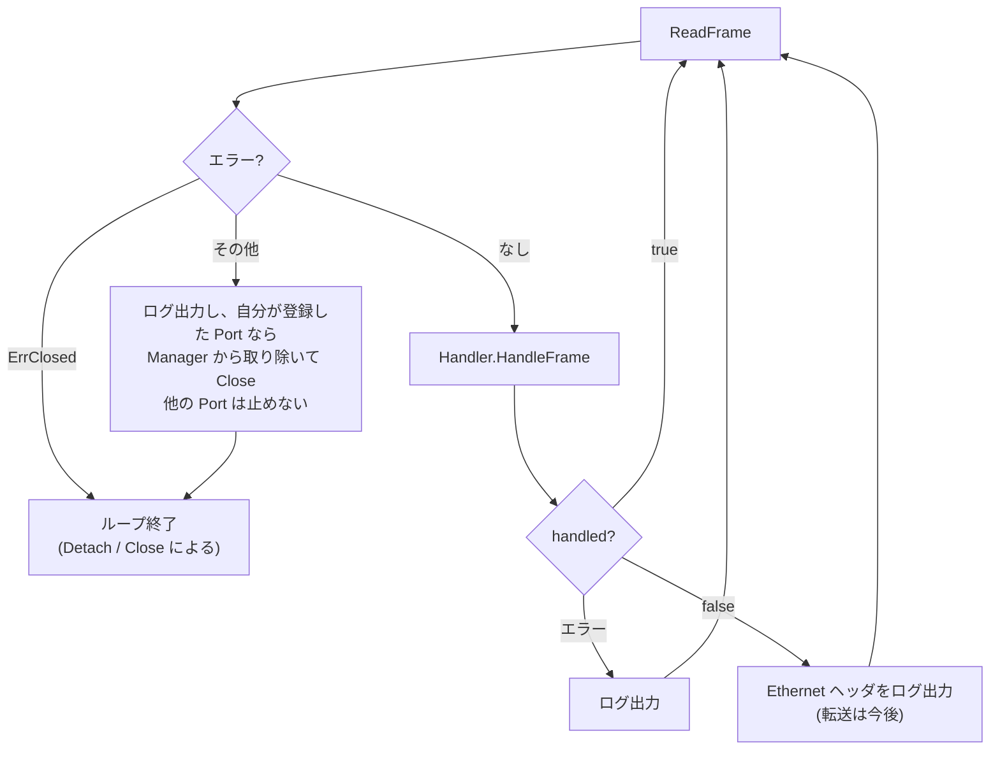
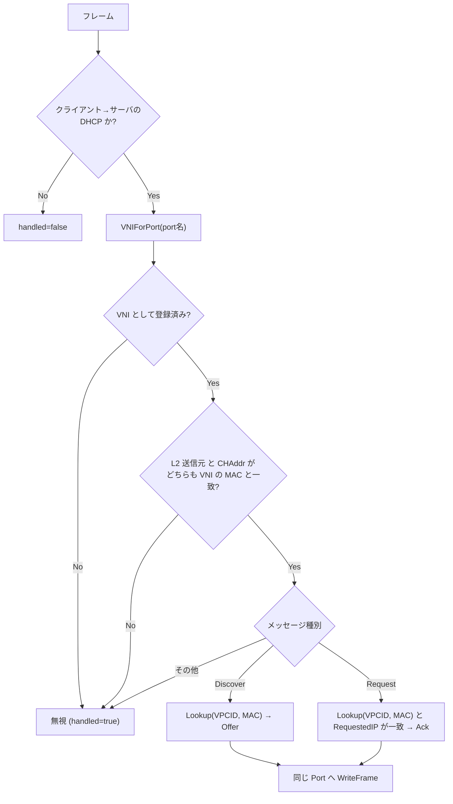

# agent の処理フロー

VNI(tap)の増減と、Port から読んだフレームの処理の流れ。全体像は [design.md](design.md) を参照。

## コンポーネント

`Source` は将来、マッピングサービスの Watch を受ける実装に差し替える。
その場合 `Register` / `Unregister` は不要になり、Sink より下は変わらない。

## VNI の追加 (PUT)

## VNI の削除 (DELETE)

未 Attach でも `Unregister` は行う。

## フレームの処理 (Port ごとの goroutine)

### DHCP の判定 (`dhcp.Handler.HandleFrame`)

